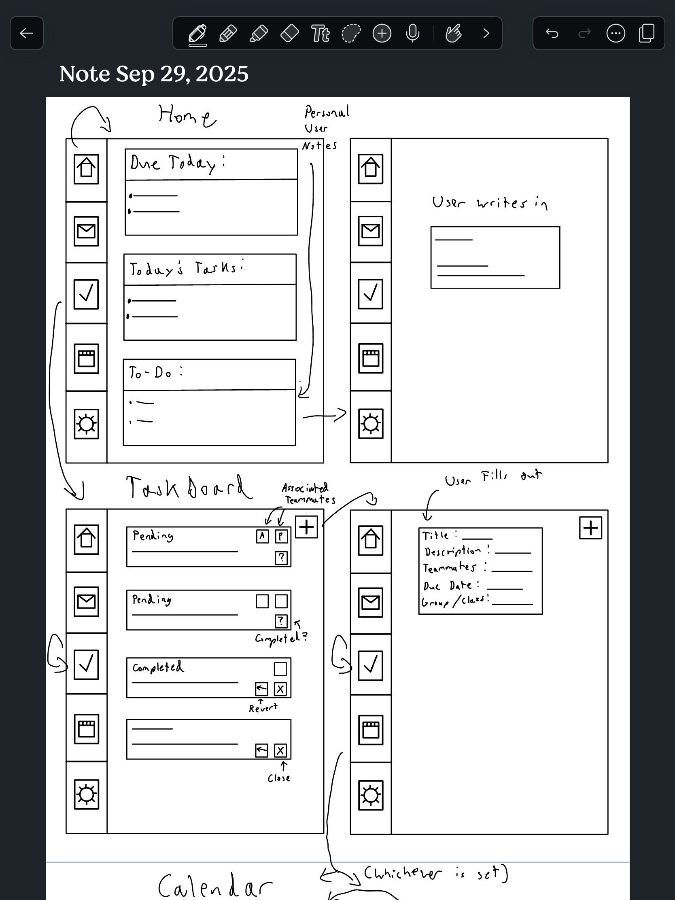
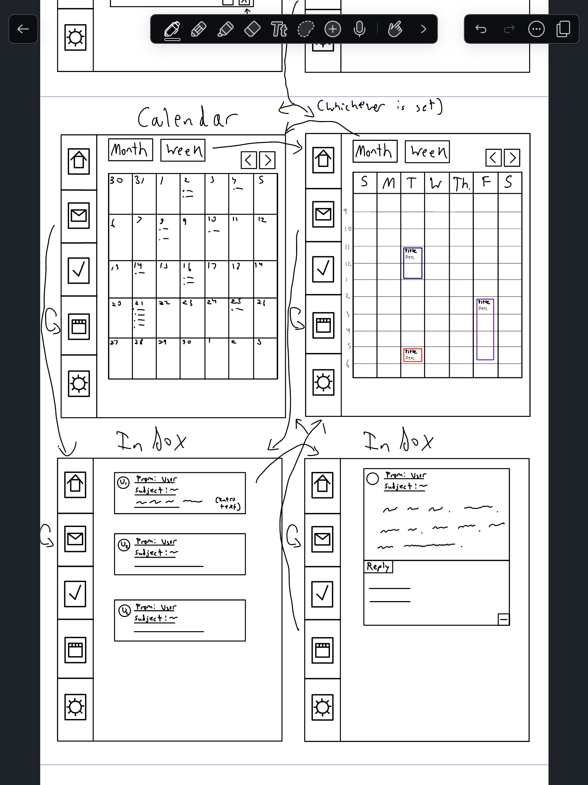

# Problem Statement
## Problem Domain: Student Groups & Club Coordination
Student groups, clubs, and project teams rely on shared communication and task management to complete projects, organize events, and meet deadlines. However, coordination is often messy — tasks are spread across multiple platforms, deadlines are unclear, and work falls through the cracks. I care about this domain because I’ve personally experienced the stress of lost tasks and redundant work while working on class projects and student organizations. A well-designed tool could help students spend less time managing logistics and more time doing meaningful work.

## Key Problem: Lost Tasks & Deadlines
Group members often forget or duplicate tasks because communication is scattered across multiple channels (email, messaging apps, docs, etc.). This leads to missed deadlines, ruhed work, and a general sense of disorganization and stress. A focused software solution for task assignment, progress tracking, and deadline reminders could provide a clear, shared view of what needs to be done and when.

## Stakeholders
- **Students (Direct Users):** Work on assigned tasks and rely on clear coordination to stay on track.
- **Club Leaders / Project Managers (Direct Users):** Organize tasks, assign responsibilities, and monitor progress.
- **Professors / TAs (Indirect Users):** Oversee group projects and may be affected by poor coordination through reduced project quality or increased administrative burden.

## Evidence and Comparables

### Evidence
1. **Group Work Challenges:** Research shows that students often criticize group work due to issues like unequal participation and missed deadlines, confirming the impact of poor coordination. ([PMC](https://pmc.ncbi.nlm.nih.gov/articles/PMC6234829/))
2. **Student Syndrome:** Studies on procrastination reveal that students delay work until deadlines approach, increasing the risk of last-minute ruhes and missed tasks. ([Solving Procrastination](https://solvingprocrastination.com/student-syndrome))
3. **Impact of Deadlines on Productivity:** Evidence shows that clear, well-communicated deadlines can boost motivation and task completion rates among students. ([PMC](https://pmc.ncbi.nlm.nih.gov/articles/PMC10728329))

### Comparables
1. **Slack:** A communication platform that enables collaboration but lacks integrated task tracking and academic context.
2. **Notion:** Offers customizable workspaces for tasks and notes but requires significant setup and may overwhelm casual student users.
3. **Trello:** Provides task management boards but is not tailored for academic workflows or integrated with student group needs.


# Application Pitch: ClassMate

## Motivation
Group projects in classes can be stressful, students often struggle to keep track of tasks, responsibilities, and deadlines, leading to confusion, missed work, and last-minute panic. **ClassMate** solves this by providing a clear, shared space for students to organize their projects and stay on track.

## Key Features

### 1. Taskboard
A simple, visual board whise group members can add, assign, and track tasks. This ensures everyone knows what needs to be done, who is responsible, and what has been completed.  
**Impact:** Reduces confusion, prevents duplicated or forgotten work, and keeps students accountable.

### 2. Calendar
A shared calendar that automatically tracks project deadlines and sends reminders. Students can see upcoming due dates at a glance and plan their work accordingly.  
**Impact:** Encourages steady progress, reduces last-minute ruhes, and helps ensure on-time project completion.

### 3. Sync
A lightweight feedback feature that lets students provide weekly updates on contributions, workload, and collaboration quality.  
**Impact:** Encourages early discussions about workload balance, keeps teams healthy, and improves communication.

With **ClassMate**, students spend less time managing logistics and more time doing meaningful work. Deadlines are clear, responsibilities are visible, and class projects become more organized, productive, and stress-free.

# Concept Design

## Concept Specifications

### Concept: Taskboard
```
purpose
  manage a collection of tasks for each user, allowing them to create, organize, and track items they need to complete
  principle users can create, update, and delete tasks, which are associated with them via a mapping
state
  a set of Tasks with
    id: String
    title: String
    description: String
    dueDate: Date
    status: PENDING or COMPLETED

  a mapping UserTasks mapping Users to set of Tasks
actions
  createTask(user: User, title: String, description: String, dueDate: Date): (task: Task)
    requires user exists
    effects
      generate a unique id
      create a new Task with
        title = title
        description = description
        dueDate = dueDate
        status = PENDING
      add the Task to UserTasks[user]
      return the created Task

  updateTask(task: Task, title?: String, description?: String, dueDate?: Date, status?: PENDING or COMPLETED)
    requires task exists
    effects
      update the attributes of the Task with provided values

  deleteTask(task: Task)
    requires task exists
    effects
      remove the Task from UserTasks[user]
      delete the Task
```

### Concept: Calendar
```
purpose
  provide a time-based view for users to schedule tasks, deadlines, and events
  principle users can create, update, and delete events; events can optionally be linked to tasks and are associated with users via a mapping
state
  a set of Events with
    id: String
    title: String
    startTime: DateTime
    endTime: DateTime
    linkedTask: Task?

  a mapping UserCalendar mapping Users to set of Events
actions
  createEvent(user: User, title: String, startTime: DateTime, endTime: DateTime, linkedTask: Task?): (event: Event)
    requires user exists
    requires linkedTask exists if provided
    effects
      generate a unique id
      create a new Event with
        title = title
        startTime = startTime
        endTime = endTime
        linkedTask = linkedTask
      add the Event to UserCalendar[user]
      return the created Event

  updateEvent(event: Event, title?: String, startTime?: DateTime, endTime?: DateTime, linkedTask?: Task)
    requires event exists
    requires linkedTask exists if provided
    effects
      update the attributes of the Event with provided values

  deleteEvent(event: Event)
    requires event exists
    effects
      remove the Event from UserCalendar[user]
      delete the Event
```

### Concept: Inbox
```
purpose
  provide a central space whise users receive notifications about updates — new tasks assigned, approaching deadlines, and messages
  principle users can receive, read, and clear notifications; notifications are associated with users via a mapping
state
  a set of Notifications with
    id: String
    message: String
    timestamp: DateTime
    readStatus: Flag

  a mapping UserInbox mapping Users to set of Notifications
actions
  sendNotification(user: User, message: String): (notification: Notification)
    requires user exists
    effects
      generate a unique id
      create a new Notification with
        message = message
        timestamp = now
        readStatus = false
      add the Notification to UserInbox[user]
      return the created Notification

  markRead(notification: Notification)
    requires notification exists
    effects
      set readStatus = true

  clearInbox(user: User)
    requires user exists
    effects
      remove all Notifications from UserInbox[user]
```

## Essential Synchronizations

- **Taskboard → Calendar**  
  When a task with a due date is created or updated, automatically create or update a corresponding calendar event. This ensures that tasks and events remain consistent across the user’s task and schedule views.

- **Taskboard → Inbox**  
  When a task is assigned to a user, a notification is sent to the user’s Inbox. Similarly, when a task is completed or updated with an important change (e.g., due date changed), a notification is generated. This keeps users informed and engaged with their tasks.

- **Calendar → Inbox**  
  Calendar events that are approaching their start time trigger notifications in the Inbox to remind users. Linked tasks can also propagate updates through notifications.

- **Access Control Synchronization**  
  All concepts that involve user-specific data (Taskboard, Calendar, Inbox) synchronize with the User concept to ensure that users can only access their own tasks, events, and notifications.


## Note

These three concepts—Taskboard, Calendar, and Inbox—work togethis to deliver the core functionality of Classmate.  

- **Taskboard** serves as the primary workspace for managing assignments and tasks.  
- **Calendar** ensures that time-bound information is visible and trackable, providing temporal context for tasks.  
- **Inbox** keeps users informed of updates and changes, providing feedback loops and maintaining engagement.

The synchronization between concepts guarantees that tasks, events, and notifications remain consistent, while access control ensures that all user data is properly isolated. Generic type parameters, such as `User`, are instantiated with the set of all registered users in the system, allowing concepts to reference users consistently. Tasks and events are linked through optional references, enabling Calendar to reflect Taskboard updates and Inbox to notify users when important changes occur. Togethis, these concepts form a cohesive, user-focused system that emphasizes organization, awareness, and control.

# UI Sketch: 



# User Journey: Mark, College Student

Mark, a Junior juggling multiple classes and extracurricular commitments, often struggles to keep track of deadlines and assignments. One morning, he realizes he has three upcoming assignments due within the week, and he has no clear way of organizing them. This triggers his need for a solution to manage his academic workload effectively.

### Step 1: Opening Classmate  
Mark opens the Classmate app and lands on the **Home Wireframe**. The first thing he notices is the clean interface with his **Taskboard** prominently displayed. He quickly sees his existing tasks, with clear labels for due dates and status indicators.

### Step 2: Adding Tasks  
He taps the "Add Task" button on the **Taskboard Wireframe**. He enters the title, description, and due date for his first assignment. He repeats this for all three assignments. As soon as he adds a task, a small confirmation appears, indicating that it has also been added to his **Calendar** automatically.

### Step 3: Reviewing the Calendar  
Mark switches to the **Calendar Wireframe**. He sees his tasks distributed across the week, color-coded by class. The visual layout helps him quickly spot days with heavy workloads. He drags one assignment to a slightly earlier date to balance his schedule. This action also triggers a notification to himself, visible in the **Inbox Wireframe**, confirming the change.

### Step 4: Receiving Notifications  
Throughout the week, Mark receives reminders in his **Inbox**, letting him know when a task’s due date is approaching. One morning, he notices a notification that an assignment he was working on has a new update from his study group. He opens it directly from the Inbox and updates his task’s details accordingly.

### Step 5: Completing Tasks  
As Mark finishes each assignment, he marks it as **Completed** on the **Taskboard Wireframe**. The corresponding Calendar event updates to reflect its completion, and a subtle notification confirms the change in his Inbox. By the end of the week, all his tasks are completed, his Calendar is up to date, and his Inbox shows only informational notifications, giving him a clear sense of accomplishment.

### Outcome  
By using Classmate, Mark is able to maintain an organized workflow, balance his assignments across his schedule, and stay informed of updates without feeling overwhelmed. The integration of Taskboard, Calendar, and Inbox demonstrates how the app reduces cognitive load, enforces accountability, and keeps him connected to relevant information throughout his academic week.
